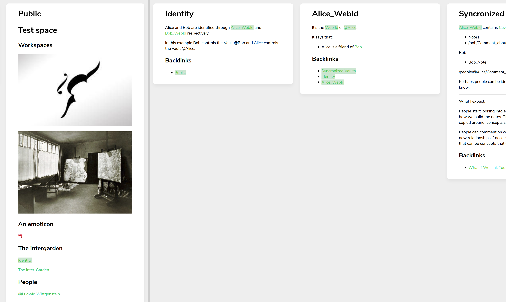

Experiment stopped. I don't feel identified.

# Prototype_10

A variant of Andy Matuschak's note-taking system, using 11ty to publish and Obsidian to author notes. 

Notes have different views.



## How to

1. Install the necessary dependencies

```sh
yarn install
```

1. Create symbolic links for each Obsidian vault in ./src/notes

```sh
ln -s source_vault ./src/notes/public
```

1. Run eleventy

```sh
yarn start
```

or

```sh
eleventy --output=output --serve
```

## Caution

Don't use:

'?', '&', '#', in the titles. 